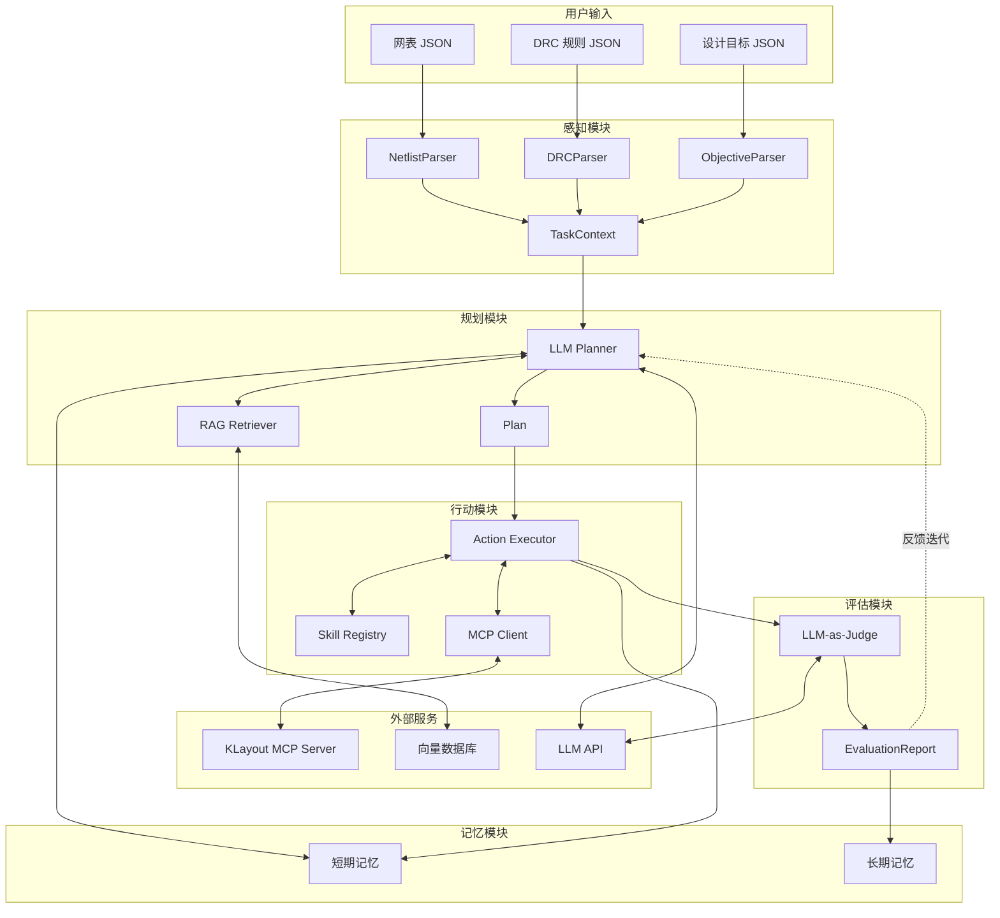

# 第1章 项目概述与架构设计

---

## 1.1 项目概述

### 1.1.1 项目目标

本系统旨在构建一个基于大语言模型（LLM）的智能版图设计 Agent，能够自动完成模拟集成电路（以单级差分对运算放大器为 MVP 场景）的版图生成。系统核心能力包括：

1. **网表解析与理解**：自动解析 JSON 格式网表，识别电路拓扑结构、器件参数及连接关系
2. **知识检索与应用**：通过 RAG 机制从版图技巧知识库中检索相关设计经验，指导版图规划
3. **自动版图生成**：调用 KLayout MCP 和技能模块，完成器件放置、匹配布局和基础布线
4. **设计规则检查**：自动执行 DRC 检查，确保生成版图符合工艺约束
5. **自我评估与迭代**：通过 LLM-as-Judge 评估模块评估设计质量，支持反馈驱动的迭代优化

### 1.1.2 MVP 范围

当前版本（MVP）明确限定以下边界：

| 维度 | MVP 范围 | 暂不支持 |
|------|----------|----------|
| **电路类型** | 单级差分对运算放大器（差分对 + 电流镜 + 尾电流源） | 多级运放、复杂模拟系统 |
| **工艺范围** | 选定的 toy PDK 或开源 PDK 子集（如 Sky130 简化版） | 完整商业 PDK |
| **DRC 规则** | Poly、Metal1/Metal2、Contact/Via 的基本宽度、间距、覆盖规则 | 复杂 DFM 规则、天线规则 |
| **设计目标** | 面积最小化 + 匹配优先（双目标权重） | 多目标复杂优化 |
| **布线能力** | 局部区域基础布线（供电/地线 + 少量信号线） | 全局复杂布线、总线布线 |

---

## 1.2 总体系统架构

### 1.2.1 架构概览

系统采用 **"感知-规划-行动-记忆"** 的循环架构，以 LLM 为核心决策引擎，通过 MCP 协议与外部工具交互。

```
┌─────────────────────────────────────────────────────────────────────────┐
│                           用户输入层                                      │
│  ┌──────────────┐  ┌──────────────┐  ┌──────────────┐                   │
│  │ 网表 JSON    │  │ DRC 规则 JSON │  │ 设计目标 JSON │                   │
│  └──────┬───────┘  └──────┬───────┘  └──────┬───────┘                   │
└─────────┼─────────────────┼─────────────────┼───────────────────────────┘
          │                 │                 │
          ▼                 ▼                 ▼
┌─────────────────────────────────────────────────────────────────────────┐
│                        感知模块 (Perception)                             │
│  ┌──────────────┐  ┌──────────────┐  ┌──────────────┐                   │
│  │ NetlistParser │  │ DRCParser    │  │ObjectiveParser│                  │
│  └──────┬───────┘  └──────┬───────┘  └──────┬───────┘                   │
│         │                 │                 │                            │
│         ▼                 ▼                 ▼                            │
│  ┌─────────────────────────────────────────────────────────┐            │
│  │            TaskContext (Circuit + DRCRuleSet +          │            │
│  │                    DesignObjectives)                     │            │
│  └─────────────────────────┬───────────────────────────────┘            │
└────────────────────────────┼────────────────────────────────────────────┘
                             │
                             ▼
┌─────────────────────────────────────────────────────────────────────────┐
│                        规划模块 (Planning)                               │
│  ┌─────────────────────────────────────────────────────────┐            │
│  │                    LLM Planner                          │            │
│  │  (Plan-and-Execute 宏观规划 + ReAct 细节执行)            │            │
│  └─────────────────────────┬───────────────────────────────┘            │
│                            │                                             │
│         ┌──────────────────┼──────────────────┐                         │
│         ▼                  │                  ▼                         │
│  ┌──────────────┐          │           ┌──────────────┐                 │
│  │ RAG Retriever │◄────────┼──────────►│ Memory Module │                │
│  └──────────────┘          │           └──────────────┘                 │
│                            ▼                                             │
│              ┌─────────────────────────┐                                │
│              │     Plan (步骤列表)      │                                │
│              └─────────────┬───────────┘                                │
└────────────────────────────┼────────────────────────────────────────────┘
                             │
                             ▼
┌─────────────────────────────────────────────────────────────────────────┐
│                        行动模块 (Action)                                 │
│  ┌─────────────────────────────────────────────────────────┐            │
│  │                  Action Executor                         │            │
│  └─────────────────────────┬───────────────────────────────┘            │
│                            │                                             │
│         ┌──────────────────┼──────────────────┐                         │
│         ▼                  ▼                  ▼                         │
│  ┌──────────────┐  ┌──────────────┐  ┌──────────────┐                   │
│  │Skill Registry │  │ MCP Client   │  │ Tool Results │                  │
│  └──────┬───────┘  └──────┬───────┘  └──────────────┘                   │
│         │                 │                                              │
│         ▼                 ▼                                              │
│  ┌──────────────────────────────────────┐                               │
│  │         KLayout MCP Server            │                               │
│  │  (版图生成 + DRC 检查 + GDS 导出)      │                               │
│  └──────────────────────────────────────┘                               │
└─────────────────────────────────────────────────────────────────────────┘
                             │
                             ▼
┌─────────────────────────────────────────────────────────────────────────┐
│                        评估模块 (Evaluation)                             │
│  ┌─────────────────────────────────────────────────────────┐            │
│  │                  LLM-as-Judge                            │            │
│  │  (DRC 合规性 + 性能达成度 + 设计合理性评估)               │            │
│  └─────────────────────────┬───────────────────────────────┘            │
│                            │                                             │
│                            ▼                                             │
│              ┌─────────────────────────┐                                │
│              │   EvaluationReport      │                                │
│              └─────────────────────────┘                                │
└─────────────────────────────────────────────────────────────────────────┘
```

### 1.2.2 架构图（Mermaid）



### 1.2.3 组件部署形态

| 组件 | 部署形态 | 说明 |
|------|----------|------|
| **Orchestrator** | 本地 Python 进程 | 主控制程序，协调所有模块 |
| **LLM Planner** | 远程 API 调用 | 调用 OpenAI/Claude 等 LLM API |
| **感知模块** | 内嵌于 Orchestrator | 作为 Python 模块集成 |
| **行动模块** | 内嵌于 Orchestrator | 作为 Python 模块集成 |
| **Skill Registry** | 内嵌于 Orchestrator | 技能模块注册表 |
| **KLayout MCP Server** | 独立本地进程 | 通过 stdio/HTTP 与 Orchestrator 通信 |
| **RAG Retriever** | 内嵌于 Orchestrator | 调用向量数据库服务 |
| **向量数据库** | 本地服务或内嵌 | 开发环境可用 Chroma 内嵌，生产可用独立服务 |
| **记忆模块** | 内嵌于 Orchestrator | 短期内存 + 长期向量存储 |
| **评估模块** | 内嵌于 Orchestrator | 调用 LLM API 进行评估 |

---

## 1.3 模块划分与职责

### 1.3.1 感知模块 (Perception)

**职责描述**：
- 解析用户输入的 JSON 文件，转换为系统内部数据结构
- 校验输入数据的完整性和合法性
- 构建统一的任务上下文对象

**主要对外接口**：

| 接口名 | 功能 | 签名示例 |
|--------|------|----------|
| `parse_netlist` | 解析网表 JSON | `parse_netlist(json_path: str) -> Circuit` |
| `parse_drc_rules` | 解析 DRC 规则 | `parse_drc_rules(json_path: str) -> DRCRuleSet` |
| `parse_objectives` | 解析设计目标 | `parse_objectives(json_path: str) -> DesignObjectives` |
| `build_task_context` | 构建任务上下文 | `build_task_context(circuit, drc_rules, objectives) -> TaskContext` |

**关键依赖**：
- JSON 解析库
- 数据校验库（如 Pydantic）

### 1.3.2 规划模块 (Planning)

**职责描述**：
- 分析任务上下文，制定宏观版图设计策略
- 将高层目标分解为可执行的步骤序列
- 在执行过程中进行动态调整和细节规划
- 集成 RAG 检索结果和历史记忆

**主要对外接口**：

| 接口名 | 功能 | 签名示例 |
|--------|------|----------|
| `create_initial_plan` | 生成初始规划 | `create_initial_plan(context: TaskContext, memory: Memory) -> Plan` |
| `refine_plan` | 根据反馈调整规划 | `refine_plan(prev_plan: Plan, feedback: Feedback) -> Plan` |
| `plan_next_step` | ReAct 模式下规划下一步 | `plan_next_step(state: ExecutionState) -> PlanStep` |

**关键依赖**：
- LLM API（OpenAI/Claude）
- RAG Retriever
- Memory Module

### 1.3.3 行动模块 (Action)

**职责描述**：
- 将规划步骤映射为具体的工具调用
- 管理 MCP 客户端与 KLayout 服务的通信
- 处理工具执行结果，包括成功、失败和异常情况
- 将执行结果反馈给规划模块和记忆模块

**主要对外接口**：

| 接口名 | 功能 | 签名示例 |
|--------|------|----------|
| `execute_step` | 执行单个规划步骤 | `execute_step(step: PlanStep) -> StepResult` |
| `execute_plan` | 执行完整规划 | `execute_plan(plan: Plan) -> ExecutionResult` |
| `call_tool` | 调用单个工具 | `call_tool(request: ToolCallRequest) -> ToolCallResult` |

**关键依赖**：
- MCP Client
- Skill Registry
- KLayout MCP Server

### 1.3.4 记忆模块 (Memory)

**职责描述**：
- 管理当前设计会话的短期记忆（执行状态、中间结果）
- 管理跨会话的长期记忆（历史案例、成功/失败经验）
- 提供记忆的存储、检索和更新能力

**主要对外接口**：

| 接口名 | 功能 | 签名示例 |
|--------|------|----------|
| `store_step_result` | 存储步骤执行结果 | `store_step_result(step: PlanStep, result: StepResult)` |
| `get_execution_history` | 获取当前会话执行历史 | `get_execution_history() -> List[StepRecord]` |
| `store_case` | 存储完成的设计案例 | `store_case(case: DesignCase)` |
| `retrieve_similar_cases` | 检索相似历史案例 | `retrieve_similar_cases(context: TaskContext, top_k: int) -> List[DesignCase]` |

**关键依赖**：
- 向量数据库（Chroma/Pinecone）
- 嵌入模型

### 1.3.5 评估模块 (Evaluation)

**职责描述**：
- 对生成的版图进行多维度评估
- 计算量化指标（DRC 错误数、面积、匹配度）
- 生成结构化评估报告
- 触发迭代优化流程

**主要对外接口**：

| 接口名 | 功能 | 签名示例 |
|--------|------|----------|
| `evaluate_layout` | 评估版图质量 | `evaluate_layout(layout: Layout, context: TaskContext) -> EvaluationReport` |
| `compute_metrics` | 计算量化指标 | `compute_metrics(layout: Layout, drc_result: DRCResult) -> LayoutMetrics` |
| `should_iterate` | 判断是否需要迭代 | `should_iterate(report: EvaluationReport) -> bool` |

**关键依赖**：
- LLM API（LLM-as-Judge）
- DRC 检查结果
- 版图几何分析工具

### 1.3.6 RAG 知识库 (RAG)

**职责描述**：
- 管理版图技巧文档的知识库
- 提供语义检索能力
- 支持知识库的增量更新

**主要对外接口**：

| 接口名 | 功能 | 签名示例 |
|--------|------|----------|
| `retrieve_knowledge` | 检索相关知识 | `retrieve_knowledge(query: str, context: RetrievalContext) -> List[Chunk]` |
| `index_documents` | 索引文档 | `index_documents(doc_paths: List[str])` |
| `update_index` | 增量更新索引 | `update_index(doc_path: str)` |

**关键依赖**：
- 嵌入模型
- 向量数据库
- 文档解析工具

### 1.3.7 技能注册表 (Skill Registry)

**职责描述**：
- 注册和管理所有可用的技能模块
- 提供技能发现和调用能力
- 管理技能版本

**主要对外接口**：

| 接口名 | 功能 | 签名示例 |
|--------|------|----------|
| `register_skill` | 注册技能 | `register_skill(skill: SkillDefinition)` |
| `get_skill` | 获取技能 | `get_skill(name: str, version: str = None) -> Skill` |
| `list_skills` | 列出所有技能 | `list_skills() -> List[SkillInfo]` |
| `invoke_skill` | 调用技能 | `invoke_skill(name: str, params: dict) -> SkillResult` |

**关键依赖**：
- KLayout MCP Server
- GDSFactory（可选）

---

## 1.4 模块接口与数据流向

### 1.4.1 MVP 典型流程时序说明

以下描述单级差分对运放版图自动生成的完整流程：

#### 阶段 1：输入解析

```
1. Orchestrator 接收输入文件路径
   输入: netlist.json, drc_rules.json, objectives.json
   
2. 调用 Perception.parse_netlist(netlist.json)
   输出: Circuit 对象
   
3. 调用 Perception.parse_drc_rules(drc_rules.json)
   输出: DRCRuleSet 对象
   
4. 调用 Perception.parse_objectives(objectives.json)
   输出: DesignObjectives 对象
   
5. 调用 Perception.build_task_context(circuit, drc_rules, objectives)
   输出: TaskContext 对象
```

#### 阶段 2：初始规划

```
6. 调用 Memory.retrieve_similar_cases(task_context, top_k=3)
   输出: List[DesignCase] - 相似历史案例

7. 调用 RAG.retrieve_knowledge(query="单级差分运放版图布局技巧", context)
   输出: List[Chunk] - 相关知识片段

8. 调用 Planning.create_initial_plan(task_context, rag_chunks, similar_cases)
   输出: Plan 对象，包含步骤列表如:
   - Step 1: parse_netlist - 解析网表构建电路模型
   - Step 2: create_common_centroid_pair - 生成差分对共质心布局
   - Step 3: create_current_mirror - 生成电流镜匹配布局
   - Step 4: route_signal_nets_basic - 完成基础信号布线
   - Step 5: run_drc_check - 执行 DRC 检查
   - Step 6: export_gds - 导出 GDS 文件
```

#### 阶段 3：执行步骤

```
9. 循环执行 Plan 中的每个步骤:
   
   9.1 对于每个 PlanStep:
       a. Action.execute_step(step)
          - 构造 ToolCallRequest
          - 调用 MCPClient.call_tool(request)
          - 解析 ToolCallResult
       
       b. Memory.store_step_result(step, result)
       
       c. 如果失败且可重试:
          - Planning.plan_next_step(state) 使用 ReAct 模式调整
          - 重新执行调整后的步骤

10. 收集所有步骤结果，构造 ExecutionResult
```

#### 阶段 4：评估与迭代

```
11. 调用 Evaluation.evaluate_layout(layout, task_context)
    - 调用 LLM-as-Judge 进行定性评估
    - 计算量化指标 (DRC 错误数、面积、匹配度)
    输出: EvaluationReport

12. 调用 Evaluation.should_iterate(report)
    - 检查是否满足目标阈值
    - 检查是否达到最大迭代次数

13. 如果需要迭代:
    a. 调用 Planning.refine_plan(prev_plan, report.feedback)
    b. 返回阶段 3 重新执行
    
14. 如果通过或达到最大迭代:
    a. Memory.store_case(design_case) - 存储为长期记忆
    b. 返回最终结果
```

### 1.4.2 核心数据对象类型

| 数据对象 | 描述 | 主要字段 |
|----------|------|----------|
| `Circuit` | 电路内部表示 | `devices: List[Device]`, `nets: List[Net]`, `modules: List[CircuitModule]` |
| `Device` | 单个器件 | `id`, `type`, `model`, `params`, `terminals` |
| `Net` | 网络连接 | `name`, `connections: List[TerminalRef]` |
| `DRCRuleSet` | DRC 规则集 | `tech`, `layers: Dict`, `rules: List[DRCRule]` |
| `DRCRule` | 单条 DRC 规则 | `id`, `type`, `layer`, `min`, `max` |
| `DesignObjectives` | 设计目标 | `objectives: List[Objective]`, `constraints: DesignConstraints` |
| `TaskContext` | 任务上下文 | `circuit`, `drc_rules`, `objectives`, `session_id` |
| `Plan` | 执行计划 | `steps: List[PlanStep]`, `status`, `created_at` |
| `PlanStep` | 计划步骤 | `id`, `skill_name`, `params`, `dependencies`, `status` |
| `ToolCallRequest` | 工具调用请求 | `name`, `input`, `trace_id` |
| `ToolCallResult` | 工具调用结果 | `ok`, `error`, `data`, `duration_ms` |
| `EvaluationReport` | 评估报告 | `metrics`, `qualitative_feedback`, `score`, `suggestions` |
| `LayoutMetrics` | 版图指标 | `drc_error_count`, `area`, `matching_score` |
| `DesignCase` | 设计案例 | `context`, `plan`, `result`, `evaluation`, `timestamp` |

### 1.4.3 模块间数据流向图

```
┌────────────────┐     ┌────────────────┐     ┌────────────────┐
│  JSON 输入文件  │────►│   感知模块      │────►│  TaskContext   │
└────────────────┘     └────────────────┘     └───────┬────────┘
                                                      │
                                                      ▼
┌────────────────┐     ┌────────────────┐     ┌────────────────┐
│  List[Chunk]   │◄────│   RAG 模块      │◄────│   规划模块      │
└────────────────┘     └────────────────┘     └───────┬────────┘
                                                      │
┌────────────────┐                                    │
│List[DesignCase]│◄────────────────────────────┐      │
└────────────────┘                             │      ▼
                       ┌────────────────┐     ┌┴───────────────┐
                       │   记忆模块      │◄───►│     Plan       │
                       └────────────────┘     └───────┬────────┘
                              ▲                       │
                              │                       ▼
┌────────────────┐            │               ┌────────────────┐
│ToolCallResult  │◄───────────┼───────────────│   行动模块      │
└───────┬────────┘            │               └───────┬────────┘
        │                     │                       │
        │                     │                       ▼
        │              ┌──────┴───────┐       ┌────────────────┐
        └─────────────►│   评估模块    │◄──────│ KLayout MCP    │
                       └──────┬───────┘       └────────────────┘
                              │
                              ▼
                       ┌────────────────┐
                       │EvaluationReport│
                       └────────────────┘
```

---

## 1.5 与后续章节的关系说明

### 1.5.1 章节关联概述

本架构设计章节定义了系统的整体结构和模块划分，后续各章节将围绕此架构展开详细规格：

| 后续章节 | 对应架构模块 | 主要细化内容 |
|----------|--------------|--------------|
| 第2章 RAG 知识库实现 | RAG 模块 | 文档预处理、切片策略、检索器实现 |
| 第3章 技能模块实现 | Skill Registry + KLayout MCP | 各 Skill 的 API 规格和实现逻辑 |
| 第4章 Agent 核心逻辑实现 | Planning + Action + Memory | 主循环、状态管理、LLM 调用 |
| 第5章 数据模型与接口 | Perception | JSON Schema、解析器、数据结构定义 |
| 第6章 测试与评估框架 | Evaluation | 测试策略、用例设计、CI 集成 |
| 第7章 部署与配置 | 全局 | 环境配置、服务启动、运维指南 |

### 1.5.2 需后续章节细化的核心名词/接口

以下名词和接口将在后续章节中给出详细定义，全文档需保持命名一致：

**数据结构**：
- `Circuit` - 第5章详细定义
- `Device` - 第5章详细定义
- `Net` - 第5章详细定义
- `DRCRuleSet` / `DRCRule` - 第5章详细定义
- `DesignObjectives` - 第5章详细定义
- `Chunk` - 第2章详细定义
- `DesignCase` - 第4章详细定义

**模块接口**：
- `SkillRegistry.invoke_skill()` - 第3章详细定义
- `RAG.retrieve_knowledge()` - 第2章详细定义
- `Memory.store_case()` / `retrieve_similar_cases()` - 第4章详细定义
- `Planning.create_initial_plan()` / `refine_plan()` - 第4章详细定义

**配置项**：
- LLM API 配置 - 第7章详细定义
- 向量数据库配置 - 第7章详细定义
- KLayout MCP 连接配置 - 第7章详细定义

---

## 附录 A：工程假设与推荐实现方式

以下内容为本文档的工程假设或推荐实现方式，不与 proposal 冲突但需在实现时确认：

1. **推荐实现语言**：Python 3.10+，与 KLayout Python API (pya) 兼容
2. **推荐 LLM**：GPT-4 或 Claude 3，通过 OpenAI/Anthropic API 调用
3. **推荐向量数据库**：开发环境使用 Chroma（内嵌模式），生产环境可考虑 Pinecone
4. **推荐嵌入模型**：`text-embedding-3-small` 或 BGE 系列中英文模型
5. **MCP 通信方式**：优先使用 stdio 模式，备选 HTTP/WebSocket
6. **日志框架**：Python `logging` 模块 + 结构化 JSON 输出
